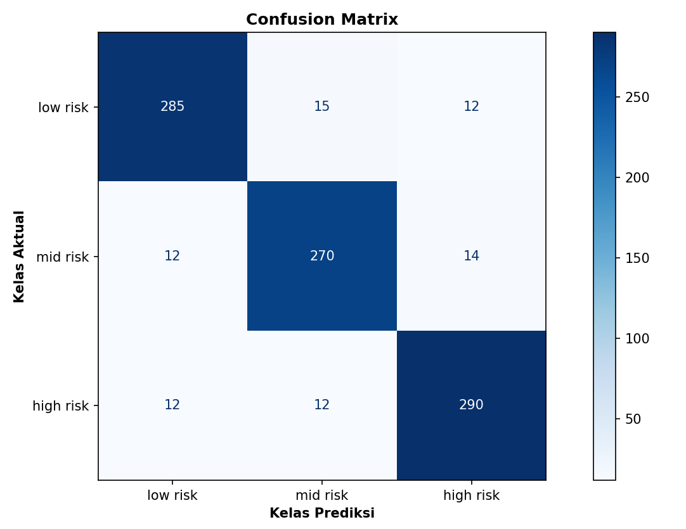

# Maternal Health Risk Prediction Using KELM

This project presents a maternal health risk classification system using Kernel Extreme Learning Machine (KELM) with outlier handling using Isolation Forest.

## Project Overview

The objective of this project is to classify maternal health risk levels into three categories:

- Low Risk
- Mid Risk
- High Risk

The study evaluates the performance of KELM using different kernel functions and compares the classification results before and after outlier handling.

## Methodology

The main workflow of this project consists of:

1. Maternal health dataset preparation
2. Data preprocessing
3. Outlier detection and handling using Isolation Forest
4. Classification using Kernel Extreme Learning Machine (KELM)
5. Comparison of different kernel functions
6. Model evaluation using classification metrics
7. Confusion matrix analysis
8. Accuracy comparison

## Experimental Setup

The experimental evaluation was conducted to investigate the performance of Kernel Extreme Learning Machine (KELM) under different parameter and kernel configurations.

The experiments consisted of the following stages:

1. **10-Fold Cross-Validation**
   
   The dataset was evaluated using 10-fold cross-validation to assess the classification performance of the KELM model.

2. **Regularization Parameter (C) Experiment**
   
   Several regularization parameter values were evaluated:
   
   - C = 0.1
   - C = 1
   - C = 10
   - C = 100

3. **Kernel Function Experiment**
   
   Four kernel functions were compared:
   
   - Linear
   - Polynomial
   - Radial Basis Function (RBF)
   - Sigmoid

4. **Outlier Handling Experiment**
   
   The experiments were conducted both with and without Isolation Forest to evaluate the effect of outlier handling on classification performance.

The performance of each configuration was evaluated using accuracy, sensitivity, and specificity.

## Kernel Functions

The KELM models evaluated in this project include:

- Linear Kernel
- Polynomial Kernel
- Radial Basis Function (RBF) Kernel
- Sigmoid Kernel

## Outlier Handling

Isolation Forest is applied to identify and handle outliers in the maternal health dataset before the classification process.

The effect of outlier handling is evaluated by comparing model performance before and after the outlier handling process.

## Evaluation

Model performance is evaluated using:

- Accuracy
- Sensitivity
- Specificity
- Confusion Matrix

The confusion matrix is used to visualize the classification results for the three maternal health risk categories.

## Results

The experimental evaluation was conducted using 10-fold cross-validation to investigate the performance of the KELM model under different configurations.

The experiments evaluated:

- Regularization parameter (C): 0.1, 1, 10, and 100
- Kernel functions: Linear, Polynomial, RBF, and Sigmoid
- Outlier handling: with and without Isolation Forest

The performance of each configuration was evaluated based on accuracy, sensitivity, and specificity.

### Best Result

Among the evaluated configurations, the best classification performance was obtained using Isolation Forest combined with KELM using a Polynomial kernel and a regularization parameter of C = 0.1.

| Outlier Handling | Kernel | C | Cross-Validation | Accuracy |
|---|---|---:|---:|---:|
| Isolation Forest | Polynomial | 0.1 | 10-Fold | **92.09%** |

The model achieved an average accuracy of **92.09%** using 10-fold cross-validation.

## Confusion Matrix

The confusion matrix below presents the classification performance of the best-performing KELM configuration: Polynomial kernel with C = 0.1 and Isolation Forest.

## Tools and Technologies

- Python
- NumPy
- Matplotlib
- Scikit-learn
- Kernel Extreme Learning Machine (KELM)
- Isolation Forest

## Dataset

The Maternal Health Risk dataset is used for maternal health risk classification.
**Dataset Source:** Kaggle

## Research Context

This repository contains the implementation and supporting code for a research project on maternal health risk classification using KELM with different kernel functions and outlier handling.
